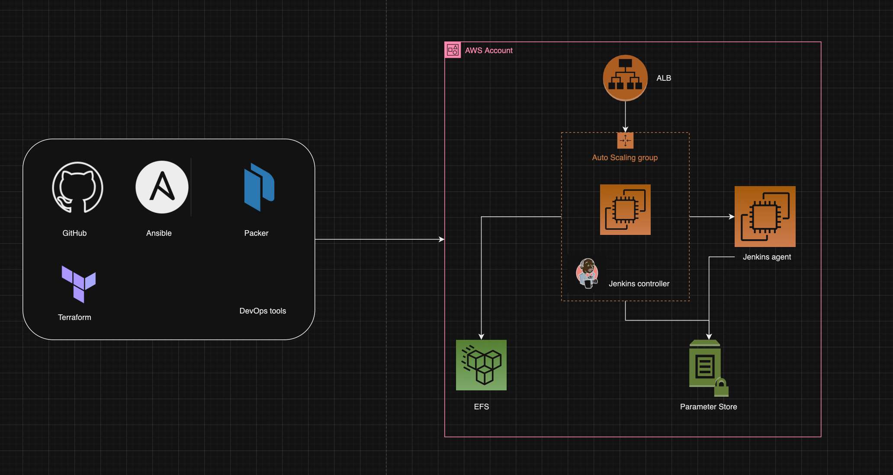

## Introduction



In this DevOps project, we will learn how to deploy Jenkins on an AWS Autoscaling group with an Application Load Balancer and EFS filesystem for Jenkins’ data directory. The project aims to implement:

- Immutable Infrastructure
- Infrastructure as Code (Provisioning & Configuration Management)
- External Config/Secret management

## Tools & Services Used

### DevOps Tools:

- **GitHub**: Repository to store IaC.
- **Packer**: To build Jenkins Controller and agent AMIs.
- **Ansible**: To configure Jenkins controller and agent during the AMI building process.
- **Terraform**: To provision AWS resources.
- **Python Boto3**: To retrieve SSH public key from AWS parameter store.

### AWS Services:

- **IAM**: To create IAM Role/Instance Profile for Jenkins Controller and Agent Nodes.
- **EFS**: To store Jenkins data.
- **AWS Parameter Store**: To store SSH private and public keys as secrets to configure agents.
- **Autoscaling Group**: To deploy the Jenkins controller.
- **Application Load Balancer**: To have a static DNS endpoint for the Jenkins controller instance running in the autoscaling group.

## Prerequisites

Ensure the following components are installed and properly configured:

- Hashicorp Packer
- Terraform
- Ansible
- AWS CLI (configured with default region as us-west-2 and AWS credentials with admin access)

We'll use the default VPC in the us-west-2 (Oregon) region, utilizing three subnets from the following availability zones:

- us-west-2a
- us-west-2b
- us-west-2c

Ensure you have an existing key pair in the AWS Oregon region for SSH access.

## Project Architecture

The Jenkins HA setup utilizes AWS Autoscaling Group and EFS. The entire workflow is as follows:

- Use the default VPC in the us-west-2 (Oregon) region.
- Provision EFS storage spanning three availability zones using Terraform.
- Create an SSH key pair and upload it to the AWS Parameter Store.
- Use Packer and Ansible to build the controller and agent AMIs.
- Deploy the controller AMI in an auto-scaling group using Terraform.
- Deploy an agent server using Terraform.
- Validate the Jenkins setup.

## Project File Structure

```
.
├── ansible
│   ├── jenkins-agent.yaml
│   ├── jenkins-controller.yaml
│   ├── roles
│   └── scripts
├── jenkins-agent.pkr.hcl
├── jenkins-controller.pkr.hcl
└── terraform
    ├── efs
    ├── iam
    ├── lb-asg
    ├── agent
    ├── modules
      ├── ec2
      ├── efs
      ├── iam
      └── lb-asg
```

## Note

* After using this setup, especially for learning purposes, ensure to clean up AWS resources to avoid unnecessary costs.

